# Custom Crawler 사용방법

`Custom Crawler`는 `Koromo Copy` 사용자가 쉽게 크롤러를 작성할 수 있도록 도와주는 도구입니다.
이 도구를 사용하면 누구나 손쉽게 새로운 크롤러를 작성할 수 있습니다.

## 0. 선행 지식

`HTML`의 간단한 문법, `XPath` 읽는 방법, 문자열 `Split`함수, 이 세 가지를 알고 있으면 더 쉽게 크롤러를 제작할 수 있습니다.

`도구 탭->도구 및 유틸리티->커스텀 크롤러`를 통해 커스텀 크롤러를 실행할 수 있습니다.

### 0.1. HTML 구조 및 문법

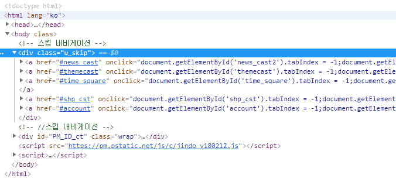

네이버(http://www.naver.com)의 `HTML` 파일 구조

위 사진과 같이 `HTML`은 `<html> ~ </html>`, `<head> ~ </head>`, `<body> ~ </body>` 처럼 `<> ~ </>`에 둘러싸여 있습니다.
이런 계층 구조 덕분에 우리는 `HTML` 파일을 쉽게 분석할 수 있습니다.

우리가 `HTML`을 분석함에 있어서 꼭 알아야 할 문법은 딱 두 가지 입니다.

``` html
<a href="https://google.com">링크</a>

```

바탕화면에 `a.html` 파일을 만들고 위 `HTML`을 복사한 후 브라우져로 실행해 보세요.

`<a> ~ </a>` 태그는 `<a> ~ </a>`로 감싼 텍스트(또는 사진 등)에 `href` 하이퍼링크 속성을 걸어주는 태그입니다.
`href`는 감싼 텍스트를 클릭할 때 이동할 링크입니다.

`` 태그는 `src` 링크에 있는 이미지를 가져와 보여줍니다. ``태그는 닫는 태그 `</img>`가 없습니다.

### 0.2. XPath

### 0.3. 문자열 함수

## 1. 도구

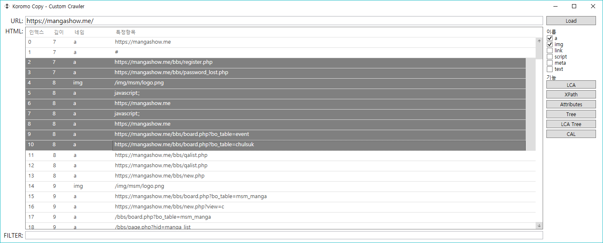

`URL` 입력 후 `Load` 버튼을 누르면, 해당 `URL`을 다운로드하고, 분석하여 리스트로 보여줍니다.
`a,img` 태그이외에 다른 태그를 보려면, `Load` 버튼 하단의 `이름`에서 리스트에 포함할 태그들을 선택하고, `Load` 버튼을 누르세요.

리스트의 요소들엔 태그들의 깊이와 특징항목(예를 들어 `a` 태그는 `href` 속성값, `img` 태그는 `src` 속성값)이 있습니다.
인덱스는 같은 깊이에서 순서대로 부여됩니다.
리스트의 요소를 더블클릭하면 `img`의 경우엔 이미지를 보여주며, `a`나 기타 태그의 경우엔 해당 링크를 실행합니다.

또한 드래그를 통해 요소들을 선택할 수 있으며, `Ctrl`키를 누른채 클릭하면 특정항목 선택/선택취소를, `Shift`키를 누른채 클릭하면 범위 선택을 할 수 있습니다.

하단 `FILTER`를 통해 원하는 특정항목을 필터링할 수 있습니다.

### 1.1. LCA (Lowest Common Ancestor)

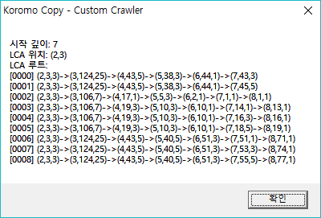

`LCA`는 선택된 태그들의 최소 공통 조상을 찾습니다.
이 기능은 개발용도로 넣어둔 것이니 `XPath` 대신 사용하시길 바랍니다.

### 1.2. XPath

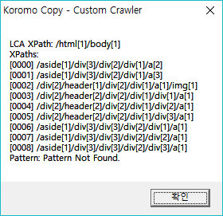

선택된 태그들의 최소 공통 조상과 선택된 태그들의 `XPath`를 보여줍니다.
`LCA XPath`와 함께 보여주며, 절대경로를 구하려면 `LCA XPath`와 각 항목을 합쳐야합니다.

가령 `[0000] /aside[1]/div[3]/div[2]/div[1]/a[2]`의 절대 경로는 `/html[1]/body[1]/aside[1]/div[3]/div[2]/div[1]/a[2]`입니다.

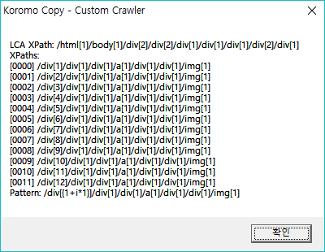

`Pattern`은 각 `XPath`의 규칙을 분석한 일반화된 `XPath`입니다.
이 패턴은 각 항목 모두를 검증하진 않기 때문에 반드시 수동 검증을 해야합니다.

### 1.3. Attributes

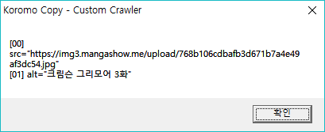

선택된 태그의 속성들을 보여줍니다.

### 1.4. Tree/LCA Tree

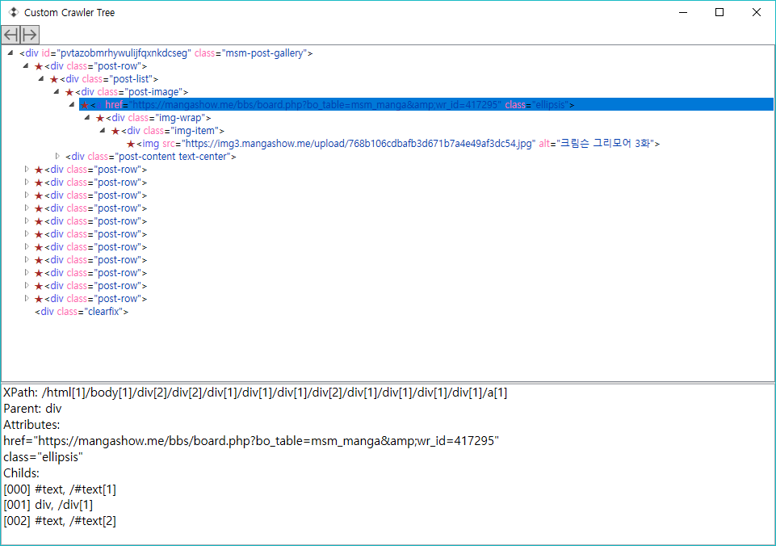

`HTML` 구조를 트리모형으로 보여줍니다.

### 1.5. CAL

`CAL` 문법에 관해선 `2. CAL 문법`을 참고하세요.

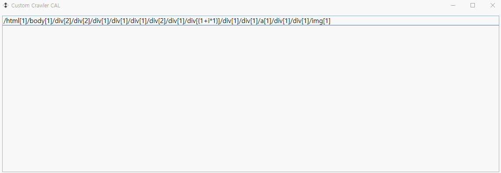

실시간으로 `CAL` 문법을 해석하고, 결과를 보여줍니다.

## 2. CAL 문법

`CAL` 문법은 크롤러를 좀 더 쉽게 만들기위해 구현한 도구입니다.
각 토큰은 `,`로 구분되며, 맨 처음 토큰은 반드시 `XPath` 또는 `Pattern`이여야 합니다.

### 2.1. 형식

`CAL` 문법은 크게 세 가지 형식이 있습니다.

#### 2.1.1. 현재 노드 탐색

`,`가 없다면 기본적으로 현재 노드를 탐색하며 현재 노드의 `InnerText`를 가져옵니다.
`InnerText`는 해당 노드에 포함된 모든 텍스트를 말합니다.
모든 텍스트를 가져오기 때문에 범위 설정에 주의해야하며, 하위 노드를 가져올 수록 좋습니다.

`,`가 있다면 두 번째 토큰은 `HTML` 탐색이나 문자열 편집 토큰이 올 수 있습니다.
토큰에 세 개 이상있다면 세 번째 토큰부턴 문자열 편집 토큰이 와야합니다.

`HTML` 탐색 토큰 유형은 다음과 같습니다.

| 토큰        | 내용        |
| --------- | ---------  |
| #text     | InnerText  |
| #htext    | CurrentText|
| #html     | InnerHtml  |
| #ohtml    | OuterHtml  |
| #attr[속성] | 헤더 속성     |

`InnerHtml`은 자기 자신을 제외한 안쪽 노드의 `HTML`을 가져오며, 
`OuterHtml`은 자기 자신을 포함한 `HTML`을 가져옵니다.

`#attr[속성]`은 `HTML` 태그의 특정 속성의 내용을 가져올 수 있습니다.
가령, `#attr[href]`는 `a` 태그의 링크 주소를 가져옵니다.

문자열 편집 토큰 유형은 다음과 같습니다.

| 토큰                  | 내용               |
| ------------------- | ---------------- |
| #split[text, index] | 문자열 자르기          |
| #regex[pattern]     | 매칭되는 전체 항목을 검색   |
| #gregex[pattern]    | 괄호로 둘러싸여진 부분만 검색 |

`#split[text, index]` 속성을 통해 문자열을 자를 수 있습니다.
`index`는 0부터 시작하는 항목이며, `-1`일 경우 맨 마지막 항목을 가져옵니다.

#### 2.1.2. 패턴 입력

패턴은 `/div[{1+i*1}]/a[1]`와 같이 `XPath`에 `{~}`가 포함된 형식입니다.
안쪽 `{~}`형식은 임의의 상수 a,b,c와 변수 i에 대하여 `i*b`, `a+i*c` 형식만 올 수 있습니다.
(추후에 범용 연산 기능을 구현할 예정입니다.)

패턴 토큰이 첫 번째 토큰으로 있다면 두 번째 토큰은 위 `2.1.1.`과 같은 방법으로 각각 적용됩니다.

#### 2.1.3. 하위 노드 탐색

두 번째 토큰이 `.`로 시작하는 `XPath`라면 하위 노드를 검색할 수 있습니다.
가령 `./img`는 바로 하위 항목들 중 `img` 태그를 가진 노드를 가져오며,
`.//img`는 모든 하위 항목들 중 `img`태그를 가진 노드를 가져옵니다.

이때 세 번째 토큰은 위 `2.1.1.`과 같은 방법으로 각각 적용됩니다.

## 3. 제작

준비물 : `FireFox`, `Chrome` 또는 개발자 도구가 지원되는 웹 브라우져

`Custom Crawler`의 기능에서 `Create`를 클릭하여 제작합니다.

### 3.1. 속성 정보

| 속성                | 내용                                                                  |
| ----------------- | ------------------------------------------------------------------- |
| ScriptName        | 스크립트 이름입니다.                                                         |
| ScriptVersion     | 스크립트 버전입니다.                                                         |
| ScriptAuthor      | 스크립트 작성자 입니다.                                                       |
| ScriptFolderName  | 스크립트의 대표 폴더 이름입니다.                                                  |
| ScriptRequestName | 다운로드 탭에서 보여지는 이름입니다.                                                |
| PerDelay          | SubURL 탐색시 각 항목이 끝날때마다 기다릴 시간(ms)입니다.                               |
| UsingDriver       | 드라이버를 사용할지의 여부입니다.                                                  |
|                   |
| URLSpecifier      | 스크립트를 특정할 수 있는 URL 입니다.                                             |
| TitleCAL          | 대표제목을 가져오는 CAL 문법입니다.                                               |
| ImagesCAL         | 이미지들을 가져오는 CAL 문법입니다. SubURL이 있다면, 사용되지 않습니다.                       |
| FileNameCAL       | 파일이름들을 가져오는 CAL 문법입니다. SubURL이 있다면, 사용되지 않습니다.                      |
|                   |
| UsingSub          | 하위 URL들을 가져오는 크롤러 유형인지의 여부입니다.                                      |
| SubURLCAL         | 하위 URL들을 가져오는 CAL 문법입니다.                                            |
| SubURLTitleCAL    | 하위 URL의 제목들을 가져오는 CAL 문법입니다. 이 항목이 비어있다면 SubTitleCAL을 통해 제목을 설정합니다. |
| SubTitleCAL       | 하위 URL의 제목을 가져오는 CAL 문법입니다.                                         |
| SubImagesCAL      | 하위 URL의 이미지들을 가져오는 CAL 문법입니다.                                       |
| SubFileNameCAL    | 하위 URL의 파일이름들을 가져오는 CAL 문법입니다.                                      |

### 3.2. 제작 방법

커스텀 크롤러로 크롤러를 작성하려는 경우, 다음 절차와 예제를 확인하여 따라하시면됩니다.

한 페이지만 가져오려는 경우

```
1. 웹 브라우져에서 제목을 복사한뒤 text 이름와 FILTER를 통해 XPath를 확정합니다.
2. 제목을 가져올 수 있는 CAL 문법을 작성합니다.
3. 위와 같은 방법으로 이미지들을 가져올 수 있는 CAL 문법을 작성합니다.
4. 위와 같은 방법으로 파일이름들을 가져올 수 있는 CAL 문법을 작성합니다.
```

하위 페이지들을 가져오려는 경우

```
1. 웹 브라우져에서 제목을 복사한뒤 text 이름와 FILTER를 통해 XPath를 확정합니다.
2. 제목을 가져올 수 있는 CAL 문법을 작성합니다.
3. 위와 같은 방법으로 하위 URL을 가져올 수 있는 CAL 문법을 작성합니다.
4. 하위 URL에서 위 방법의 3,4번을 반복합니다.
```

### 3.2.1. 예제) 디시인사이드 게시글 (작성중)

### 3.2.2. 예제) 망가쇼미 작품 (작성중)

예제 주소 : 

https://mangashow.me/bbs/page.php?hid=manga_detail&manga_name=%ED%9E%88%ED%86%A0%EB%A6%AC+%EB%B4%87%EC%B9%98%EC%9D%98+OO%EC%83%9D%ED%99%9C

https://mangashow.me/bbs/board.php?bo_table=msm_manga&wr_id=419587


#### 3.2.2.1. 제목 가져오기

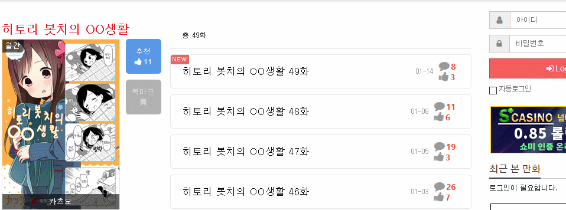

먼저 웹 브라우져의 개발자 도구를 통해 제목의 위치를 파악합니다.
`페이지에서 요소 고르기`를 통해 쉽게 찾을 수 있습니다.

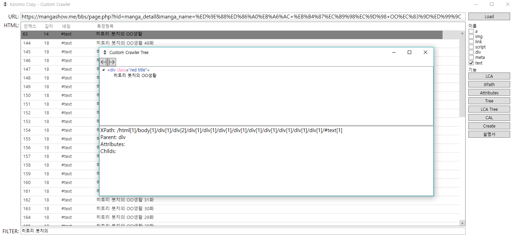

`text` 태그만 선택한 뒤 `Load`를 클릭해 목록을 불러오고, 위에서 찾은 항목을 찾습니다.
`LCA Tree` 기능을 이용해 선택한 항목이 웹 브라우져에서 본 위치와 같은지 확인합니다.

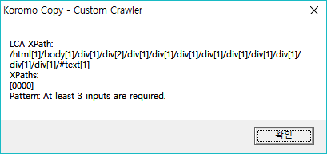

`XPath` 기능이나 `Tree`, `LCA Tree` 기능을 이용해 선택한 항목의 `XPath`를 가져옵니다.

```
LCA XPath: /html[1]/body[1]/div[1]/div[2]/div[1]/div[1]/div[1]/div[1]/div[1]/div[1]/div[1]/div[1]/div[1]/#text[1]
```

이제 `TitleCAL` 속성을 구했습니다. `CAL` 문법 `/html[1]/body[1]/div[1]/div[2]/div[1]/div[1]/div[1]/div[1]/div[1]/div[1]/div[1]/div[1]/div[1], #text`를 입력하면 제목을 가져올 수 있습니다.
`CLA`기능에서 확인해보세요.

#### 3.2.2.2. 하위 URL 주소 및 제목 가져오기

마찬가지로 하위 URL의 정보를 파악한 뒤 정보를 가져옵니다.

먼저 제목을 찾으면 다음과 같습니다.

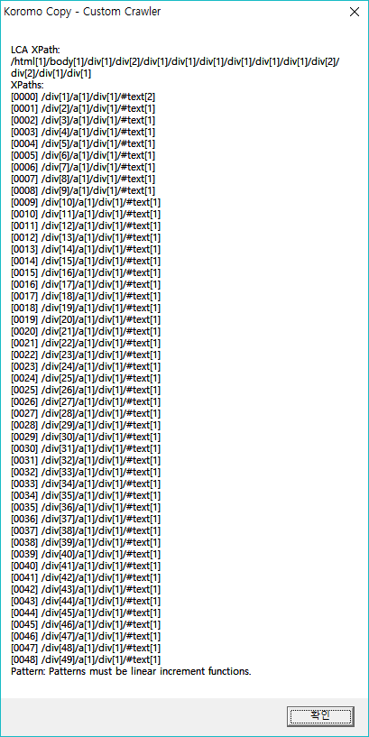

```
LCA XPath: /html[1]/body[1]/div[1]/div[2]/div[1]/div[1]/div[1]/div[1]/div[1]/div[1]/div[2]/div[2]/div[1]/div[1]

XPaths:

[0000] /div[1]/a[1]/div[1]/#text[2]
[0001] /div[2]/a[1]/div[1]/#text[1]
[0002] /div[3]/a[1]/div[1]/#text[1]
[0003] /div[4]/a[1]/div[1]/#text[1]
...
[0044] /div[45]/a[1]/div[1]/#text[1]
[0045] /div[46]/a[1]/div[1]/#text[1]
[0046] /div[47]/a[1]/div[1]/#text[1]
[0047] /div[48]/a[1]/div[1]/#text[1]
[0048] /div[49]/a[1]/div[1]/#text[1]
```

첫 번째 항목 `/div[1]/a[1]/div[1]/#text[2]` 때문에 선형 패턴이 나오지 않으므로, `LCA Tree`를 이용해 이 항목의 계층구조 확인후 `CLA`를 작성합니다.

```
SubURLTitleCAL = /html[1]/body[1]/div[1]/div[2]/div[1]/div[1]/div[1]/div[1]/div[1]/div[1]/div[2]/div[2]/div[1]/div[1]/div[{1+i*1}]/a[1], #text
```

구조가 달라 가져올 수 없는 경우엔 하위 URL에서 제목을 가져올 수 있습니다.


`a` 태그를 통해 링크 주소를 가져온 후 `XPath`를 추출합니다.

```
LCA XPath: /html[1]/body[1]/div[1]/div[2]/div[1]/div[1]/div[1]/div[1]/div[1]/div[1]/div[2]/div[2]/div[1]/div[1]

XPaths:

[0000] /div[1]/a[1]
...
[0008] /div[9]/a[1]

Pattern: /div[{1+i*1}]/a[1]
```

`a` 태그의 `href`속성에 URL이 있으므로 SubURLCAL는 다음과 같이 작성합니다.

```
SubURLCAL = /html[1]/body[1]/div[1]/div[2]/div[1]/div[1]/div[1]/div[1]/div[1]/div[1]/div[2]/div[2]/div[1]/div[1]/div[{1+i*1}]/a[1], #attr[href]
```

#### 3.2.2.3. 하위 URL의 이미지 목록과 파일이름 목록 가져오기


#### 3.2.2.4. 최종 정리

```
제목: /html[1]/body[1]/div[1]/div[2]/div[1]/div[1]/div[1]/div[1]/div[1]/div[1]/div[1]/div[1]/div[1]
부 제목: /html[1]/body[1]/div[1]/div[2]/div[1]/div[1]/div[1]/div[1]/div[1]/div[1]/div[2]/div[2]/div[1]/div[1]/div[{1+i*1}]/a[1], #text
작품들 링크: /html[1]/body[1]/div[1]/div[2]/div[1]/div[1]/div[1]/div[1]/div[1]/div[1]/div[2]/div[2]/div[1]/div[1]/div[{1+i*1}]/a[1], #attr[href]
```

https://mangashow.me/bbs/board.php?bo_table=msm_manga&wr_id=417295

```
제목: /html[1]/body[1]/div[1]/div[2]/div[1]/div[1]/div[1]/div[2]/div[1]/div[1]/h1[1]
이미지: /html[1]/body[1]/div[1]/div[2]/div[1]/div[1]/div[1]/section[1]/div[1]/form[1]/div[1]/div[{1+i*1}]/div[1], #attr[style], #regex[https://[^\)]*]
```

망가쇼미 스크립트 전문

``` json
{
  "ScriptName": "Mangashowme",
  "ScriptVersion": "1.0",
  "ScriptAuthor": "dc-koromo",
  "ScriptFolderName": "mangashowme",
  "ScriptRequestName": "mangashow-me",
  "PerDelay": 1000,
  "UsingDriver": false,
  "URLSpecifier": "https://mangashow.me/",
  "TitleCAL": "/html[1]/body[1]/div[1]/div[2]/div[1]/div[1]/div[1]/div[1]/div[1]/div[1]/div[1]/div[1]/div[1]",
  "ImagesCAL": "",
  "FileNameCAL": "",
  "UsingSub": true,
  "SubURLCAL": "/html[1]/body[1]/div[1]/div[2]/div[1]/div[1]/div[1]/div[1]/div[1]/div[1]/div[2]/div[2]/div[1]/div[1]/div[{1+i*1}]/a[1], #attr[href]",
  "SubURLTitleCAL": "/html[1]/body[1]/div[1]/div[2]/div[1]/div[1]/div[1]/div[1]/div[1]/div[1]/div[2]/div[2]/div[1]/div[1]/div[{1+i*1}]/a[1], #text",
  "SubTitleCAL": "",
  "SubImagesCAL": "/html[1]/body[1]/div[1]/div[2]/div[1]/div[1]/div[1]/section[1]/div[1]/form[1]/div[1]/div[{1+i*1}]/div[1], #attr[style], #regex[https://[^\\\\)]*]",
  "SubFileNameCAL": "/html[1]/body[1]/div[1]/div[2]/div[1]/div[1]/div[1]/section[1]/div[1]/form[1]/div[1]/div[{1+i*1}]/div[1], #attr[style], #regex[https://[^\\\\)]*], #split[/,-1]"
}
```

## 4. 배포

`Create`의 `Save`를 통해 스크립트를 추출하고, `.json`파일만 배포하면됩니다.
다른 사용자가 사용하려는 경우엔 `Create`에서 `Open`후 `Import`해야합니다.

직접만든 스크립트를 `Koromo Copy`에 적용시키고 싶을 경우 `koromo.software@gmail.com`으로 스크립트를 보내주시기 바랍니다.