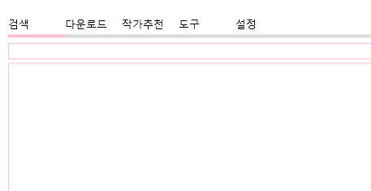
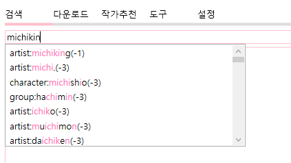
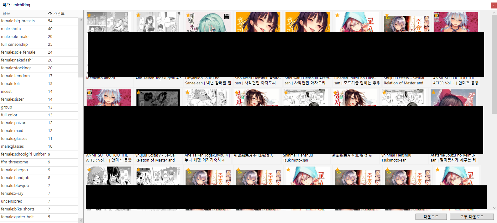
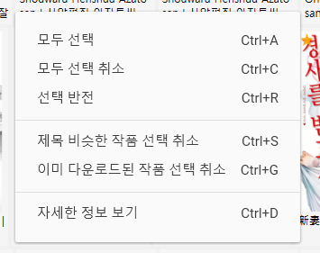
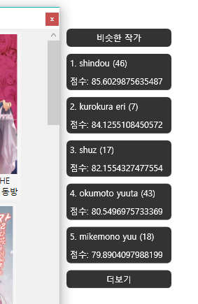
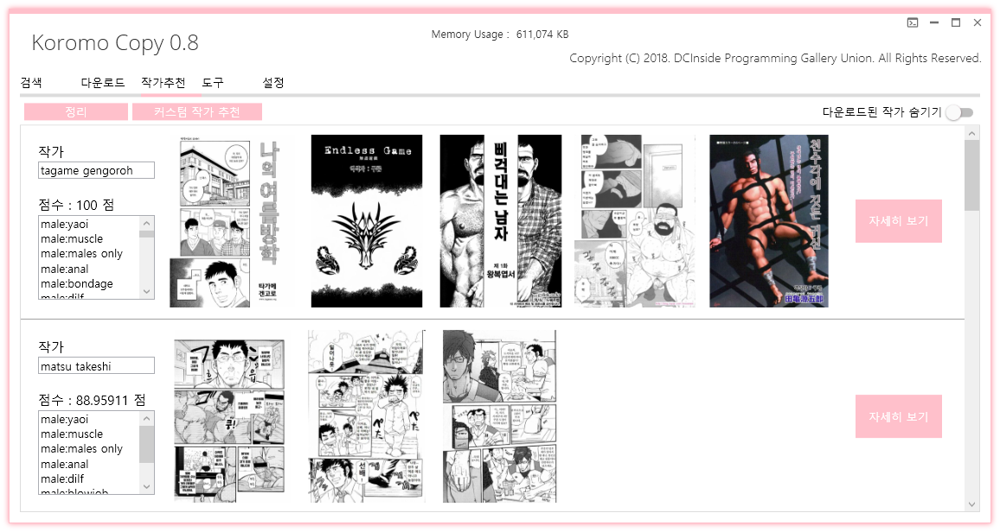
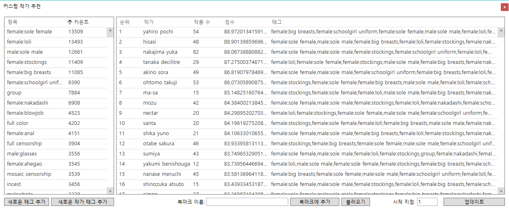
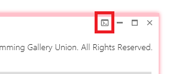

# Koromo Copy 도움말

`Koromo Copy`는 다운로드 및 도구를 제공하는 범용 유틸리티입니다. `Hitomi Copy`를 시작으로 많은 분들이 관심을 가져주어서 좀 더 나은 프로그램을 개발하고자 새로 시작한 프로젝트 입니다. `Koromo Copy`의 본래 계획은 다양한 기능을 가진 범용 유틸리티를 만드는 것이었으나, 여러가지 이유로 `Hitomi Copy` 처럼 `Hitomi`를 메인으로하여 개발하게 되었습니다.

1. [프로그램 사용법](#1-프로그램-사용법)
    1. [검색하는 방법](#11-검색하는-방법)
    2. [기타 사이트 다운로더](#12-기타-사이트-다운로더)
    3. [작품/작가/그룹/댓글/미리보기 창](#13-작품작가그룹댓글미리보기-창)
    4. [작가추천 기능](#14-작가추천-기능)
    5. [설정](#15-설정)
    6. [생성되는 모든 파일 목록](#16-생성되는-모든-파일-목록)
    7. [도구 및 유틸리티](#17-도구-및-유틸리티)
    8. [콘솔](#1x-콘솔)
2. [FAQ](#2-faq)

---

# 1. 프로그램 사용법

## 1.1. 검색하는 방법

제목, 히토미 번호, 작가 이름 등 아무거나 집어넣으면 알아서 검색이 됩니다. 다만, 좀 더 엄격한 검색을 위해선 다음과 같은 검색방법을 알아야합니다.



기본적으로 어떤 검색어를 타이핑하면 위 사진과 같이 자동완성 목록이 표시됩니다. 이 자동완성 목록이 표시되면 키보드 화살표 버튼으로 아이템을 선택할 수 있으며, 특정 아이템을 선택하고 엔터키를 누르거나, 마우스 더블클릭으로 검색창에 추가시킬 수 있습니다. 자동완성 오른쪽에 표시된 숫자는 해당 검색어로 검색하면 몇 개의 검색결과가 나오는지 보여줍니다. 이 검색결과는 설정된 언어는 적용되나, 제외 태그를 적용하지 않은 모든 검색결과입니다.

`Prefix :` 어떤 검색어 앞에 붙여서 검색 범위를 줄이는 핵심 키워드입니다. `artist`, `group`, `character`, `series`, `tag`, `tagx`, `female`, `male`, `type`, `recent`, `/`, `?` 이렇게 12가지가 있습니다.

단순하게 `michiking`을 검색하면 작가 뿐만아니라 제목에 포함된 michiking, 시리즈에 포함된 michiking 등을 모두 검색하게 됩니다. 여기에 `Prefix`인 `artist`를 붙히면 특정 작가를 모두 검색합니다. `artist:michiking`으로 검색하면 작가가 michiking은 작품 목록을 검색할 수 있습니다.

검색어에 공백이 들어간 경우엔, `_`를 붙여 검색하면됩니다. 가령, `hinahara emi`를 검색하려는 경우, `artist:hinahara_emi`를 검색하면됩니다.

`tagx` 키워드는 제외 태그입니다. 설정에 있는 제외 태그들이 기본적으로 포함됩니다.

`type`은 `doujinshi`, `manga`, `artistcg`, `gamecg`를 검색할 수 있는 키워드입니다.

`recent`는 최근 작품을 불러옵니다. 가령, `recent:0-25`라고 검색하면, 최신순으로 0번재 작품부터 25개를 가져오라는 명령이됩니다. 검색어에 `recent`가 포함되면, 다른 검색어들은 모두 무시되며, 다음 목록을 엔터키로 쉽게 불러올 수 있게 `recent:25-25`처럼 작품의 개수만큼 시작위치가 늘어납니다.

`/` 키워드는 검색 결과를 보여줄 시작위치입니다. 가령, `artist:michiking /5`를 검색하면, 5번째 작품부터 검색결과를 보여줍니다.

`?` 키워드는 검색 결과의 개수입니다. 가령, `artist:michiking /5 ?5`를 검색하면, 5번째 작품부터 5개의 검색결과를 보여줍니다. `/`, `?` 키워드가 같이 사용된다면, 어느게 먼저 나오든 `/` 키워드 먼저 처리되며, `?`가 나중에 처리됩니다. `?` 키워드도 `/`와 마찬가지로 독립적으로 사용될 수 있습니다.

`Koromo Copy`의 검색 방법은 기본적으로 `And`입니다. 모든 검색어는 공백으로 나뉘며, 각각의 검색어들을 모두 포함한 작품이 검색됩니다.



`Koromo Copy`엔 퍼지 검색 기능이 있습니다. 퍼지 검색기능은 위 사진과 같이 가장 비슷한 순으로 자동완성 목록을 보여줍니다. 오른쪽에 표시되는 숫자는 타이핑된 단어와 비슷한 단어와의 차이를 나타냅니다.

`Koromo Copy`에 새로 추가된 `고급 검색`은 집합연산을 사용하는 검색 방법입니다. 가령, `artist:michiking - (male:shota lang:japanes)`를 검색하면, `michiking` 작가의 작품 중 `male:shota`태그가 없고, 일본어가 아닌 작품들을 모두 가져옵니다. 집합 연산 중 차집합 연산은 사칙연산이 아니기 때문에 다음과 같은 해석의 오류가 있을 수 있습니다. 가령, `artist:michiking - (male:shota - lang:korean)`를 검색할 때 이 검색어를  `artist:michiking - male:shota + lang:korean`와 동치로 보면 안됩니다. 정확한 해석은 `michiking` 작가의 작품 중 `male:shota` 태그가 없거나, 언어가 한국어인 작품을 가져오는 것입니다. `고급 검색`에선 `or`, `and`, `~`, `-`, `+`, `&`, `|` 토큰을 사용할 수 있습니다.

## 1.2. 기타 사이트 다운로더

검색창에 주소를 붙여넣으면 알아서 다운로드 됩니다. 현재까지 구현된 사이트 목록은 다음과 같습니다.

| 사이트 이름    | 검증 Url                    |
| --------- | ------------------------- |
| Pixiv     | pixiv.net                 |
| Pinterest | pinterest.co.kr           |
| DCInside  | gall.dcinside.com         |
| 마나제로      | manazero009i.blogspot.com |
| Hiyobi    | hiyobi.me                 |
| 망가쇼미      | mangashow.me              |

독립된 다운로더와 `시리즈 관리자`는 2.0 버전을 배포하기 전에 제작할 예정입니다.

## 1.3. 작품/작가/그룹/댓글/미리보기 창

검색창에서 검색결과를 더블클릭하면 다음과 같은 창을 볼 수 있습니다.


이 창에서는 여러가지 정보들과 기능들을 보여줍니다. `업로드된 시간`을 추정해서 보여주며, `익헨에서 열기`, `히토미에서 열기`, `북마크에 추가`, `댓글 보기`, `작가 찾기`, `그룹찾기`, `시리즈 찾기`, `캐릭터 찾기`, `미리보기`, `다운로드` 기능을 사용할 수 있습니다.

`업로드된 시간`은 실제로 히토미에 업로드된 시간이 아닌 히토미 고유 번호로 추정한 시간입니다. 버전이 업데이트될 때 마다 최신 날짜가 업데이트 되므로, 최신 데이터의 경우엔 추정 날짜가 정확하지 않을 수 있습니다.

`댓글 보기` 기능은 익헨에 올라온 게시물을 찾아 댓글을 보여줍니다. 익헨에 업로드되지 않았거나, 삭제된경우 댓글을 볼 수 없습니다.

`미리보기` 기능은 작품의 전체, 또는 일부를 한 눈에 보여줍니다. 이 기능은 모든 이미지를 다운로드 받기 때문에 상당한 메모리를 사용할 수 있으며, 과하게 사용하면 프로그램이 강제종료될 수 있습니다.

`시리즈 찾기`, `캐릭터 찾기`는 `Finder`를 사용하여 해당 시리즈나 캐릭터를 찾습니다. 여러개인 경우 맨 처음에 표시된 하나만 검색합니다.

`작가 찾기`, `그룹 찾기`는 특정 작가나 그룹의 모든 작품 목록을 보여줍니다. (단, 여러개인 경우 맨 처음에 표시된 하나만 검색합니다.)



왼쪽에는 해당 작가/그룹의 모든 태그 목록이 표시되며, 오른쪽엔 모든 작품 목록이 표시됩니다. 오른쪽하단엔 `다운로드` 버튼과 `모두 다운로드` 버튼이 있는데, `다운로드` 버튼은 선택된 작품만을 다운로드하며, `모두 다운로드` 버튼은 해당 작가/그룹의 모든 작품을 다운로드하고 창을 종료합니다. 예외적으로, `그룹 찾기`에서 다운로드시 경로의 `{Artists}`토큰이 그룹 이름으로 변경됩니다.

각 작품 썸네일 왼쪽 상단에 표시되는 `★`은 사용자에 따라 다르게 나타납니다. 노란색 `★`는 해당 작품이 한 번이상 다운로드되었다는 뜻이며, 빨간색 `★`은 해당 작품의 작가나 그룹이 `북마크`되어있음을 뜻합니다.



오른쪽 작품 목록에서 오른쪽 마우스 클릭하면 위와 같은 메뉴가 표시됩니다.

`제목 비슷한 작품 선택 취소` 는 가장 최근의 작품 하나만 남기고, 모든 비슷한 제목을 가직 작품을 선택 취소합니다. 이 기능은 `Text Matching Accuracy`에 따라 작동합니다.

`Text Matching Accuracy`는 `setting.json`파일에서 `TextMatchingAccuracy`로 설정할 수 있습니다. 최대 몇 글자가 틀리야 제목이 비슷하다고 할 것인지 설정합니다.



`작가 찾기`에 한해서 작가 창 오른쪽에 `비슷한 작가`의 목록을 보여줍니다. `비슷한 작가`를 산출하는 방식은 `작가 추천`의 추천 방법과 동일하며, 알고리즘도 설정에 따라 갑니다. 각 작가를 더블클릭하면 해당 작가의 작가 창을 열 수 있으며, 더보기를 누른 후 아래로 스크롤하여 더 많은 작가를 볼 수 있습니다. 또한 상단의 `비슷한 작가`를 더블 클릭하면, `작가 추천`목록에서 해당 작가들의 목록을 볼 수 있습니다.

## 1.4. 작가추천 기능



`작가 추천`기능은 `다운로드 로그`에 따라 추천된 작가 목록을 보여주는 기능입니다. 하단으로 마우스 스크롤하면 더 많은 작가 목록을 볼 수 있습니다. 또한, `마우스 오른쪽 클릭 메뉴`에서 표시된 모든 작가목록을 `사진으로 저장`할 수 있습니다. 많은 항목이 표시되면 오류가 발생할 수 있으므로 왼쪽 상단의 `정리` 버튼을 통해 자주 정리해 주시기 바랍니다.

작가추천에서 왼쪽 상단의 `커스텀 작가 추천`을 누르면 사용자 정의에 따라 작가 추천 목록을 볼 수 있는 `커스텀 작가 추천`이 실행됩니다.



왼쪽엔 현재까지 다운로드한 작품들의 모든 태그를 취합하여 보여주며, 오른쪽엔 이를 통해 분석된 작가 목록을 보여줍니다. 왼쪽의 태그 목록은 다중 선택이 가능하며, `Ctrl+A`로 모두 선택할 수 있고, `Delete`키로 선택된 항목을 삭제할 수 있습니다.

`새로운 태그 추가`를 통해 태그 목록에 새로운 태그를 추가하거나, 이미 추가된 태그의 카운트를 바꾸기 위해 사용할 수 있습니다.

`새로운 작가 태그 추가`는 어떤 작가의 모든 태그를 태그 목록에 더합니다.

`시작위치`는 `업데이트` 버튼을 누른 후 몇 번째 순위부터 작가 목록을 보여줄 것이지 설정합니다.

모든 세팅이 끝나고 오른쪽 하단의 `업데이트` 버튼을 클릭하면 작가 추천 목록이 업데이트 됩니다.

## 1.5. 설정

### 다운로드 경로 설정방법

다운로드 경로는 설정 탭에서 바꿀 수 있습니다. 이 경로는 히토미 작품이 다운로드되는 경로이며, 마루마루/익헨은 별도의 경로에 다운로드 됩니다. 설정탭에서 `다운로더 칸 더블클릭->히토미 칸 클릭`하면 설정할 수 있는 페이지가 나옵니다.

다운로드 경로는 히토미 작품 폴더가 생성되는 규칙을 나타냅니다. 가령 `C:\Hitomi\{Artists}\{Title}`의 경우 `C:\Hitomi\` 폴더를 기본으로 하며, 하위 폴더에 `{Artists}` 폴더를 만들어 `{Title}`를 가진 폴더를 만들어 작품을 저장합니다. `{Aritsts}`, `{Title}`과 같이 `{}`로 둘러 쌓인 것을 토큰이라 부릅니다.

이런 토큰은 총 7개가 제공됩니다. `{Title}`, `{Aritst}`, `{Id}`, `{Date}`, `{Series}`이렇게 7개입니다. 경로에는 작품을 식별할 수 있는 `{Title}`, `{Id}` 토큰 중 반드시 하나가 포함되어야 합니다.

`{Groups}` 키워드는 구현되어 있지 않습니다. `그룹`별로 작품을 다운로드하려면 `그룹창`을 이용해 작품을 다운로드하세요. `그룹창`에서 `다운로드` 또는 `모두 다운로드`시 해당 `그룹`의 이름이 `{Artists}`로 치환됩니다.

## 1.6. 생성되는 모든 파일 목록

| 파일 이름                | 설명                                  |
| -------------------- | ----------------------------------- |
| setting.json         | 사용자 설정 파일입니다.                       |
| metadata.json        | 히토미 사이트에서 다운로드한 작품 목록입니다.           |
| hiddendata.json      | 403 Forbidden 데이터 목록입니다.            |
| log.json             | 다운로드 기록을 저장하는 파일입니다.                |
| bookmark.json        | 북마크를 저장하는 파일입니다.                    |
| bookmark_backup.json | 프로그램 시작시 자동으로 백업한 bookmark.json입니다. |
| isotest.log          | 고립 태그 분석시 생성되는 결과 파일입니다.            |
| tagdata.json         | 현재 사용하지 않습니다.                       |

## 1.7. 도구 및 유틸리티

소프트웨어 공학에서 `유틸리티`는 주로 시스템을 보조하는 프로그램을 말하며, `도구`는 그 이외의 나머지 것들, 시스템을 보조하진 않지만 사용자에게 도움을 주는 프로그램을 말합니다. `Koromo Copy`는 다운로드 목록을 유지보수할 수 있는 `도구` 뿐만아니라 파일시스템 전체를 탐색하거나 불필요한 프로그램의 삭제를 도와주는 `유틸리티`도 포함될 예정입니다. 이런 프로그램들은 `Koromo Copy`를 사용하는데에 전혀 지장을 미치지 않으니 원하는 기능만 사용할 수 있습니다.

다음은 `Koromo Copy Console`에서 실행할 수 있는 프로그램 모음입니다. 이 프로그램들은 `Hitomi Copy`에서 제작되었으며, `Koromo Copy`와는 다른 렌더링 방법을 사용하므로 프로그램 테마가 다를 수 있습니다. `Ctrl + T`키를 눌러 콘솔을 열고, `run fsenum`과 같이 `run` 명령과 다음 표에 나온 프로그램 이름들을 조합하여 실행시킬 수 있습니다.

| 이름       | 역할                                                                        |
| -------- | ------------------------------------------------------------------------- |
| fsenum   | 파일시스템 열거 프로그램입니다. 특정 경로를 입력하고 시작버튼을 누르면 열거 작업이 시작됩니다.                     |
| mddown   | 독립적인 Metadata Downloader 입니다. 이 프로그램은 Koromo Copy에 이미 내장되어 있는 더미 프로그램입니다. |
| strings  | 특정 폴더의 모든 폴더나 파일의 이름을 열거할 때 사용합니다. 파일목록 기능만 구현되어 있습니다.                    |
| explorer | 다운로드된 항목의 유지보수 도구입니다. 현재 핵심기능은 사용이 불가능합니다.                                |
| tagtest  | 태그의 유사도를 분석하고 그 유사도를 그래프를 통해 확인할 수 있는 프로그램입니다.                            |

다음으로 `Koromo Copy`에서 실행할 수 있는 프로그램 모음입니다. 이 프로그램들은 메인 창에서 단축키나, `도구`탭을 통해 열 수 있습니다.

| 이름        | 실행방법  | 역할                                                             |
| ---------- | -------- | -------------------------------------------------------------- |
| Statistics | 도구 탭   | 히토미 데이터들을 분석하여 간단한 통계목록을 만듭니다. |
| Index      | 도구 탭   | Koromo Copy에 내장된 번역 태그와 번역 시리즈를 모두 보여줍니다.                      |
| Zip Viewer | Ctrl + E | Zip 파일들이 들어있는 폴더를 끌어오면 해당 Zip파일들을 분석해 썸네일을 보여줍니다.              |
| Series Manager | Ctrl + S | Hiyobi-NonH, Mangashowme 등 만화데이터를 관리하는 독립적인 프로그램입니다.|


## 1.x. 콘솔

이미 만들어진 기능이지만 `UI/UX` 계획에서 제외되어 사용자에겐 보이지 않는 기능들이 매우 많습니다. 이러한 `Dummy` 기능들을 사용하려면 개발자가 제공하는 `콘솔`을 실행해야합니다.

`Ctrl + T`키를 누르거나, 다음 사진에 표시된 빨간색 버튼을 누르면 `콘솔`이 실행됩니다.



`UI/UX`가 제공하는 기능은 물론이고 다른 유용한 명령들을 통해 필요한 기능을 사용해보세요.

자세한 사항은 아래 개발자 문서에서 확인하시기 바랍니다.

https://github.com/dc-koromo/koromo-copy/blob/master/Document/Development.md#콘솔-console

---

# 2. FAQ

## 2.1. 데이터 다운로드/동기화시 오류가 발생합니다

`log.txt`파일을 `koromo.software@gmail.com`으로 보내주시면 빠르게 도와드리겠습니다.

## 2.2. chromedriver.exe는 무슨 파일인가요?

`chromedriver.exe`는 `Pinterest`등 `Java Script` 사용이 불가피한 경우에 사용하는 프로그램입니다.

## 2.3. 다운로더에 버그가 있습니다

`Koromo Copy`는 아직 개발 중인 프로그램입니다. 또한 히토미가 아닌 다른 사이트 다운로더는 아직 정식서비스 항목이 아닙니다.
따라서 사이트 변동에 따라 프로그램을 수정해야하며, 버그가 수정되면 프로그램을 재배포해야 버그가 수정된 프로그램을 사용할 수 있습니다.
버그를 발견하셨다면 디씨에 욕쓰지 마시고 `koromo.software@gmail.com`로 버그경위를 알려주시기 바랍니다.

사용자 편의를 위해 정식버전인 `2.0`버전 전까지, 다른 사이트 다운로더가 자동으로 업데이트되는 `시리즈 관리자` 프로그램을 정식 도입할 예정이니 그때까지만 기다려주세요.

## 2.4. 한국어 이외의 작품이 검색이 안되요

`Koromo Copy`는 메모리 절약을 위해 `데이터 최적화` 옵션을 기본으로 제공합니다.
이 옵션은 선택된 언어이외의 작품들을 삭제하여 메모리를 확보합니다.
`설정->다운로더->히토미`에서 `데이터 최적화` 설정항목을 끄고 재시작하면 정상적으로 검색이 될꺼예요.


---

# 3. 다운로더 지원 목록

```
Hitomi
E-Hentai
Ex-Hentai
및
Script들
```

---

# 4. 향후 계획

## UI/UX

`Hitomi Copy`시절부터 피드백해주신 부분들을 종합해보면, 검색의 불편하다는 의견이 가장 많았으며, 화면이 작은 태블릿같은 환경에서 사용하기가 불편하다는 의견도 있었습니다. 또한 처음 사용시 안내사항이 없어 사용하기 불편했다는 의견도 있었습니다.

`Koromo Copy 1.1` 버전에서 `Material Design`을 완전히 적용시킨 `Series Manager`를 선보였습니다.
앞으로 `Koromo Copy`는 익숙한 `Metro Design`을 기반으로하되, `Material Design`을 적절히 적용시키고, 페이저(Pagination) 기능 등이 추가된 현대 프로그램 트렌드에 맡게 프로그램을 바꾸어나갈 예정입니다.

## Performance

`hitomi.la` 사이트의 경우엔 `Emilia Queue`에서 초당 `5 ~ 45 MB/S`의 다운로드 속도를 보입니다.
기타 사이트의 경우엔 보통 `50 MB/S`가 넘는 다운로드 속도를 보입니다.
여기서 성능상 문제는 없지만, `코어수 * 3`이 기본적인 쓰레드로 설정되어 다운로드되다 보니 트래픽이 많은 시간대엔 다운로드 속도가 현저히 느려지고, 트래픽이 적은 시간대엔 속도가 제한되는 현상이 발생합니다.
앞으로 쓰레드는 프로그램이 알아서 관리하게끔 알고리즘을 만들 예정입니다.

---

# 기타

## 문의

`Koromo Copy`에 관한 문의는 메일 주소 `koromo.software@gmail.com`을 통해 해주시길 바랍니다. `Git Issues`는 제가 자주 안보기때문에 답변이 매우 늦어질 수 있습니다.
