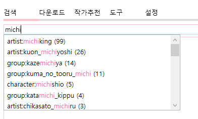

# Koromo Copy 도움말

`Koromo Copy`는 다운로드 및 도구를 제공하는 범용 유틸리티입니다. `Hitomi Copy`를 시작으로 많은 분들이 관심을 가져주어서 좀 더 나은 프로그램을 개발하고자 새로 시작한 프로젝트 입니다. `Koromo Copy`의 본래 계획은 다양한 기능을 가진 범용 유틸리티를 만드는 것이었으나, 여러가지 이유로 `Hitomi Copy` 처럼 `Hitomi`를 메인으로하여 개발하게 되었습니다. 앞으로 이러한 다운로더뿐만아니라 합법적인 유용한 도구들도 만들 계획이니 관심가져주셨으면 좋겠어요.

---

# 1. 프로그램 사용법

## 1.1. 검색하는 방법

제목, 히토미 번호, 작가 이름 등 아무거나 집어넣으면 알아서 검색이 됩니다. 다만, 좀 더 엄격한 검색을 위해선 다음과 같은 검색방법을 알아야합니다.

기본적으로 어떤 검색어를 타이핑하면 위 사진과 같이 자동완성 목록이 표시됩니다. 이 자동완성 목록이 표시되면 키보드 화살표 버튼으로 아이템을 선택할 수 있으며, 특정 아이템을 선택하고 엔터키를 누르거나, 마우스 더블클릭으로 검색창에 추가시킬 수 있습니다. 자동완성 오른쪽에 표시된 숫자는 해당 검색어로 검색하면 몇 개의 검색결과가 나오는지 보여줍니다. 이 검색결과는 설정된 언어는 적용되나, 제외 태그를 적용하지 않은 모든 검색결과입니다.

`Prefix :` 어떤 검색어 앞에 붙여서 검색 범위를 줄이는 핵심 키워드입니다. `artist`, `group`, `character`, `series`, `tag`, `tagx`, `female`, `male`, `type`, `recent`, `/`, `?` 이렇게 12가지가 있습니다.

단순하게 `michiking`을 검색하면 작가 뿐만아니라 제목에 포함된 michiking, 시리즈에 포함된 michiking 등을 모두 검색하게 됩니다. 여기에 `Prefix`인 `artist`를 붙히면 특정 작가를 모두 검색합니다. `artist:michiking`으로 검색하면 작가가 michiking은 작품 목록을 검색할 수 있습니다.

검색어에 공백이 들어간 경우엔, `_`를 붙여 검색하면됩니다. 가령, `hinahara emi`를 검색하려는 경우, `artist:hinahara_emi`를 검색하면됩니다.

`tagx` 키워드는 제외 태그입니다. 설정에 있는 제외 태그들이 기본적으로 포함됩니다.

`type`은 `doujinshi`, `manga`, `artistcg`, `gamecg`를 검색할 수 있는 키워드입니다.

`recent`는 최근 작품을 불러옵니다. 가령, `recent:0-25`라고 검색하면, 최신순으로 0번재 작품부터 25개를 가져오라는 명령이됩니다. 검색어에 `recent`가 포함되면, 다른 검색어들은 모두 무시되며, 다음 목록을 엔터키로 쉽게 불러올 수 있게 `recent:25-25`처럼 작품의 개수만큼 시작위치가 늘어납니다.

`/` 키워드는 검색 결과를 보여줄 시작위치입니다. 가령, `artist:michiking /5`를 검색하면, 5번째 작품부터 검색결과를 보여줍니다.

`?` 키워드는 검색 결과의 개수입니다. 가령, `artist:michiking /5 ?5`를 검색하면, 5번째 작품부터 5개의 검색결과를 보여줍니다. `/`, `?` 키워드가 같이 사용된다면, 어느게 먼저 나오든 `/` 키워드 먼저 처리되며, `?`가 나중에 처리됩니다. `?` 키워드도 `/`와 마찬가지로 독립적으로 사용될 수 있습니다.

히토미 카피의 검색 방법은 기본적으로 And입니다. 모든 검색어는 공백으로 나뉘며, 각각의 검색어들을 모두 포함한 작품이 검색됩니다.

히토미 카피엔 퍼지 검색 기능이 있습니다. `설정->고급설정->기타->Using Fuzzy 활성화 후->설정 저장`으로 퍼지 검색 기능을 켜고 끌 수 있습니다. 퍼지 검색기능은 위 사진과 같이 가장 비슷한 순으로 자동완성 목록을 보여줍니다. 오른쪽에 표시되는 숫자는 타이핑된 단어와 비슷한 단어와의 차이를 나타냅니다.

## 1.2. 검색기(Finder) 사용 방법

## 1.3. 작품/작가/그룹/댓글/미리보기 창

## 1.4. 작가추천 기능

## 1.5. 설정

---

# 2. FAQ

## 2.1. 데이터 다운로드/동기화시 오류가 발생합니다.

`Koromo Copy`에서도 데이터 다운로드가 안된다면 답이 없습니다. `TLS 1.3`이 보급될 때까지 존버하세요.

---

# 기타

## 유의 사항

최근 `marumaru.in`이 폐쇄됨에 따라 `Koromo Copy`에 구현된 모든 `marumaru.in`개발 코드 및 기록을 삭제했습니다. 앞으로 이런 상황에 맞추어 구현된 기능이 삭제될 수 있으며, 프로그램 전체의 UI/UX 뿐만아니라 프로그램의 컨셉자체도 완전히 변경될 수 있습니다.

## 문의

`Koromo Copy`에 관한 문의는 메일 주소 `koromo.software@gmail.com`을 통해 해주시길 바랍니다. `Git Issues`는 제가 자주 안보기때문에 답변이 매우 늦어질 수 있습니다.